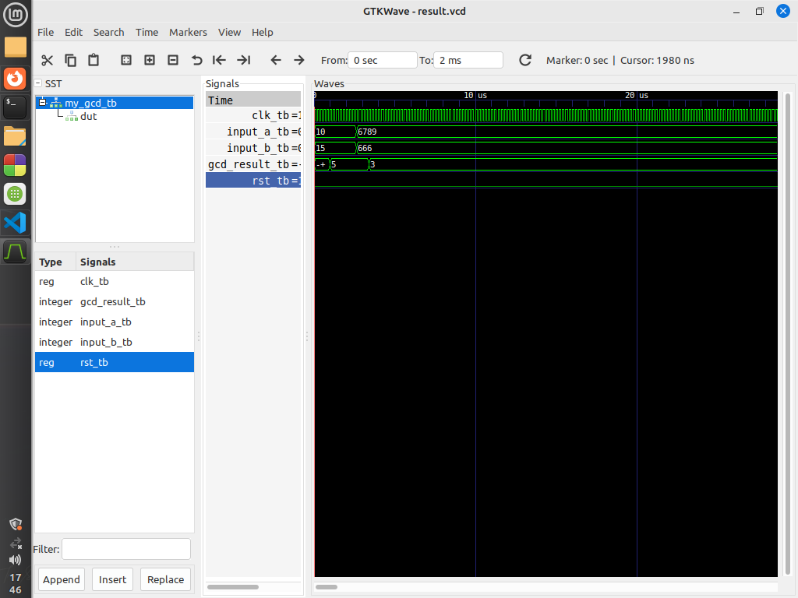

# Write VHDL code for custom single purpose processor that calculates the Greatest Common Divisor(GCD) of two numbers as Finite State Machine.

This repository contains VHDL code for a GCD (Greatest Common Divisor) calculator (`my_gcd`) and its corresponding test bench (`my_gcd_tb`). The calculator determines the greatest common divisor of two input integers (`input_a` and `input_b`) using the Euclidean algorithm.

## Entities

### `my_gcd`

The `my_gcd` entity represents a GCD calculator.

#### Ports

- `rst`: Reset signal.
- `clk`: Clock signal.
- `input_a`: Input integer.
- `input_b`: Input integer.
- `gcd_result`: Output integer representing the greatest common divisor.

## Test Cases

### Test Case 1: 

- **Input:** `input_a = '10'`, `input_b = '15'`.
- **Expected Output:** `gcd_result = '5'`.

### Test Case 2: 

- **Input:** `input_a = '6789'`, `input_b = '666'`.
- **Expected Output:** `gcd_result = '3'`.

## Output Diagram

The output diagram depicts the behavior of the GCD calculator in response to different input stimuli. It illustrates how the output greatest common divisor changes over time under various test cases.
